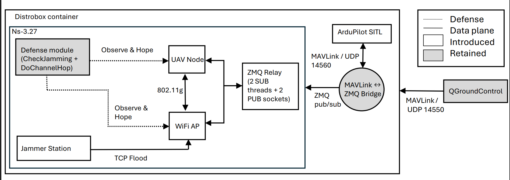

# ReCoST

**A Reproducible Co-Simulation Testbed for UAV Wi-Fi Jamming and Channel-Hopping Defense**

Artifact for the IEEE CCNC 2027 paper (Testbed Track).

ReCoST lets you fly a real drone autopilot over a *simulated* Wi-Fi network, attack that
network with jammers, and watch a defense move the drone's link to a clean channel — all on
one Linux machine, with no radios and no hardware.

It connects three real tools:

- **ArduPilot SITL** — the actual copter firmware, flying in software
- **ns-3.27** — the simulated 802.11g network the drone communicates over
- **QGroundControl** — the ground station you would use in the field

A four-thread Python bridge carries MAVLink messages between them. Five ordinary Wi-Fi
stations are re-purposed as a jammer, and a defense module inside ns-3 hops the drone to a
clean channel when packet loss crosses a threshold.

This work **extends FlyNetSim** (Baidya, Shaikh & Levorato, ACM MSWiM 2018). See
[`NOTICE`](NOTICE) for exactly which files are new, modified, or reused unchanged.

---

## How it fits together



| Plane | What runs there |
|---|---|
| **Flight** | ArduPilot SITL (copter firmware) and QGroundControl |
| **Network** | ns-3.27 in real-time mode: one access point, one drone, five jammer stations on `10.10.1.0/24`, plus the defense module |
| **Control** | `bridge/mavlink_zmq_bridge.py` — four worker threads moving MAVLink between ArduPilot (UDP) and ns-3 (ZeroMQ) |

The defense measures application-layer loss every 5 seconds. When loss crosses the
threshold, it hops the drone and the access point from channel 1 to channel 6, while the
jammers keep transmitting on channel 1.

---

## What you need

**Every measured result comes from ns-3 and the bridge**, and both run inside the container
built from [`env/Dockerfile`](env/Dockerfile) — Ubuntu 18.04, Python 3.6, gcc 7, plus
`libczmq` / `libzmq` / `libxml2` / `libsqlite3`, `pymavlink` and `pyzmq`.

**ArduPilot is not in the container.** It is large, and it does not affect the numbers.
Install it separately at the version used in the paper:

```bash
git clone https://github.com/ArduPilot/ardupilot
cd ardupilot
git checkout Copter-4.0.0        # commit 49693540
git submodule update --init --recursive
```

**QGroundControl** runs on your host. It is optional — you need it only if you want to fly
the drone by hand and watch it move. The measurements do not depend on it.

---

## Build

```bash
docker build -t flynetsim-env:latest -f env/Dockerfile .
```

This downloads ns-3.27, fetches the FlyNetSim files we reuse unchanged, applies the
patches, drops in `scratch/flynetsim`, and compiles.

Prefer not to use Docker? Run [`scripts/setup.sh`](scripts/setup.sh) from the repository
root instead — it performs the same five steps on a machine that already has the
dependencies. Distrobox users can consume the image directly:

```bash
distrobox create --image flynetsim-env:latest --name flynetsim-env
```

When the build finishes you will have the binary at
`ns-allinone-3.27/ns-3.27/build/scratch/flynetsim/flynetsim`.

---

## Choose an experiment

One `config.xml` describes one experimental point. The build copies a working default to
`ns-allinone-3.27/ns-3.27/config.xml`; edit that file before each run. Every field is
documented in [`config.example.xml`](ns3/scratch/flynetsim/config.example.xml):

| Field | What it means | Paper uses |
|---|---|---|
| `count` | number of jammer stations | `5` |
| `rate` | offered load per jammer, in Mbps | `0.0`, `0.5`, `1.0`, `5.0`, `10.0` |
| `size` | jammer packet size in bytes | `800` |
| `threshold` | loss % that triggers the channel hop | **`30` = defense ON** |


---

## Run it

Four terminals, **started in this order**. ArduPilot must be up before the bridge, and the
bridge before ns-3, or the connections will not form.

**Terminal 1 — ArduPilot SITL.** From your ArduPilot checkout. Wait for `Ready to fly`:

```bash
cd ardupilot/ArduCopter
sim_vehicle.py -v ArduCopter -f quad --no-extra-ports --out 127.0.0.1:14560
```

> `--no-extra-ports` matters. Without it, QGroundControl discovers ArduPilot directly and
> bypasses the simulated network, so jamming would have no visible effect.

**Terminal 2 — the bridge.** From the repository root:

```bash
python3 bridge/mavlink_zmq_bridge.py
```

It prints per-direction message counters every 10 seconds, which is a quick way to confirm
traffic is flowing both ways.

**Terminal 3 — ns-3.** From `ns-allinone-3.27/ns-3.27`, after editing `config.xml`:

```bash
PATH=/usr/bin:$PATH ./waf --run flynetsim
```

It prints a loss reading every 5 seconds, writes `flynetsim-results.xml` after 300
simulated seconds, and exits on its own.

**Terminal 4 — QGroundControl** *(optional, on the host)*. It listens on UDP 14550 and lets
you arm and fly the drone by hand.

---

## Get the numbers out

From the `ns-3.27` folder, where `flynetsim-results.xml` was written:

```bash
python3 /path/to/repo/scripts/master_parser.py
```

It asks for a name and writes `<name>.csv` with per-flow loss, mean delay, and jitter. The
drone's telemetry stream is the row flagged `DRONE` going from `10.10.1.2` to `10.10.1.1`.

**One run is not a result.** ns-3 uses a fixed RNG seed, but MAVLink messages arrive in real
time under host scheduling, so runs differ. The paper repeats every attacked point **six
times** and the clean baseline twice, then reports the mean with a 95 % confidence interval.
Do the same before comparing against the tables.

The exact CSVs behind the paper's tables are in [`data/`](data/README.md), organised as
`data/{baseline,jamming,defense}/<rate>/run0..5.csv`.

---

## Repository layout

```
ns3/scratch/flynetsim/   ns-3 program: uav-net-sim.cc, myApps.*, wscript, config.example.xml
ns3/patches/             mac-low-hop-assert.patch (applied at build time)
bridge/                  mavlink_zmq_bridge.py — the MAVLink/ZeroMQ bridge
scripts/                 setup.sh (build), master_parser.py (results to CSV)
env/                     Dockerfile, requirements.txt
data/                    the CSVs behind the paper's tables
figures/                 paper_method.png (display) + Paper_method.pdf (vector)
```

`myInput.cc` and `myInput.h` are **not** stored here. They belong to FlyNetSim and are
fetched from the upstream repository at build time — see [`NOTICE`](NOTICE).

---

## Citing and licence

Please cite the paper — see [`CITATION.cff`](CITATION.cff). This repository is licensed
under **GPL v2** ([`LICENSE`](LICENSE)), matching ns-3. It extends FlyNetSim; full
attribution is in [`NOTICE`](NOTICE).
